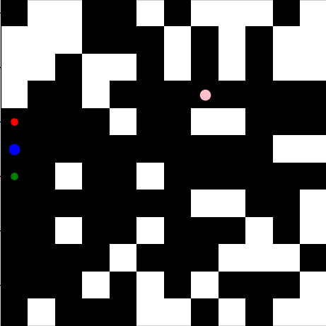

# README

## AI Bypass Challenge

This repository contains code for an AI dedicated to bypassing a player (going from behind) in a 12x12 grid. The player and the AI are randomly placed.

### Steps to Deploy and Reproduce Results

1. **Environment Setup:**

   - Make sure you have Python installed on your system.
   - Install the required libraries using the following command:
     ```bash
     pip install gymnasium numpy matplotlib stable-baselines3
     ```

2. **Clone the Repository:**

   ```bash
   git clone https://github.com/yalamanel/rl-agent-bypass-sb3.git
   cd RL-Agent-Bypass-SB3

   ```

3. **Run the Code:**
   - Run the `agent.py` script to train and test the AI.
     ```bash
     python agent.py
     ```

### Architecture Presentation

#### Custom Environment (`CustomEnv`)

- **Describing the environment:** The environment has a 12x12 grid containing obstacles, an AI and a player placed randomly.

- **Action Space:** The agent can take one of four discrete actions: move up, move down, move left, or move right.

- **Reward System:**

  - The agent receives a reward of -100 if it hits an obstacle or the player's front.
  - The agent receives a reward of 100 if it successfully bypasses the player by reaching the player's back.
  - The agent is rewarded or penalized based on its distance to the player's front and back : Rewarded if closer to the back than the front, penalized if closer to the front than the back.

- **Rendering:**
  - The environment supports rendering for human visualization, displaying the grid, the agent, and the player.

#### Training the AI

- The AI is trained using Deep Q-Learning based on the stable baselines3 library.
- The training process involves running the DQN algorithm for 10,000 steps with logging every step.
- The trained model is saved to a file named "dqn_cartpole".

#### Testing the AI

- The saved model is loaded, and the AI's performance is tested by running it in the environment.
- The AI predicts actions using the trained model until the episode is terminated or truncated.

### Additional Information

- **Random Initialization:**

  - The player, agent, and obstacles are randomly placed at the beginning of each episode.

- **Obstacle Generation:**

  - The environment generates a random number of obstacles (between 50 and 80) on the grid during initialization.

- **Player Positions:**

  - The player's back position is randomly chosen from the top, bottom, left, or right of the player.
  - The player's front position is determined based on the direction of the back position, if there is not enough room for the front, it is placed on the back so the episode has no effect on the training.

- **Visualization:**

  - The environment provides visualization during training, displaying the grid, player, and agent at each step.

- **Logging:**
  - Training progress, including rewards and actions, is logged during the training phase.

### Acknowledgments

- The code is based on the stable baselines3 library and the Gymnasium environment.
- The reliability of this code is not guaranteed as it involves numerous additions and requires some adjustments.
- For visibility matters, the obstacles are in white instead of black.

<p align="center">
  
</p>

<p align="center">
  Display overview.
</p>
